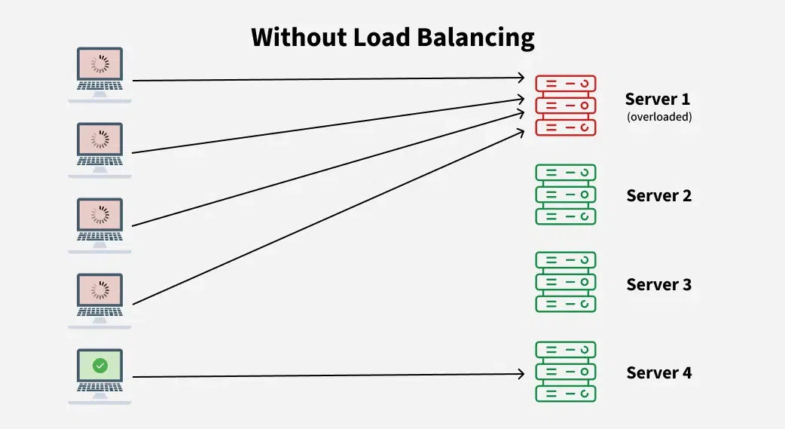
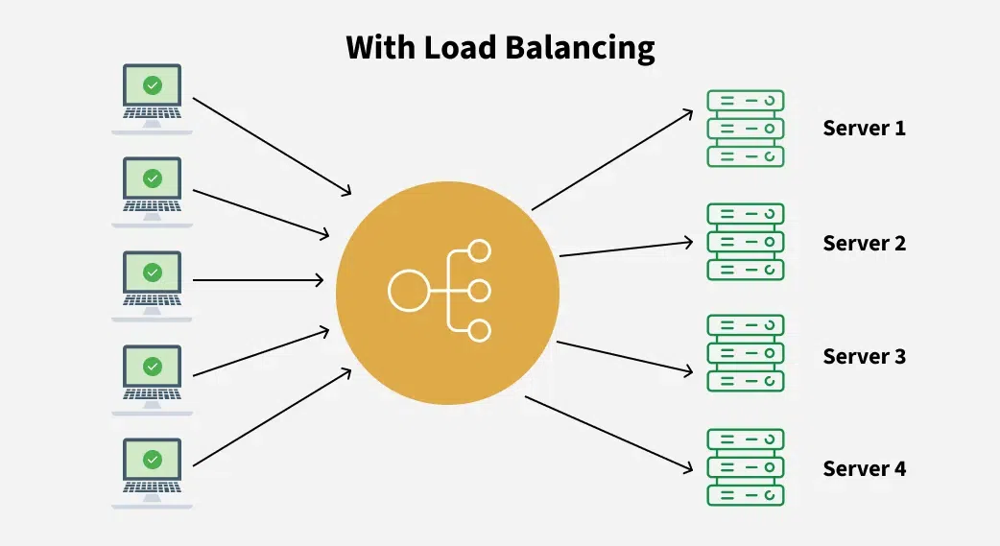

# Load Balancing (Revision Notes)

## Definition

Load Balancing is the process of distributing incoming requests across
multiple servers to: - Improve performance - Increase availability -
Prevent server overload - Achieve fault tolerance

```text
Clients
   |
Load Balancer
 /    |    \
S1   S2    S3
```

---




---

# Why Load Balancing?

- High Availability (HA)
- Better Performance
- Scalability
- Fault Tolerance
- Efficient Resource Utilization

---

# Types

### 1. Hardware Load Balancer

- Physical appliance
- Very fast
- Expensive

**Examples:** - F5 BIG-IP - Citrix ADC

---

### 2. Software Load Balancer

- Runs as software
- Cheap and flexible
- Most commonly used

**Examples:** - NGINX - HAProxy - Traefik - Envoy

---

### 3. Cloud Load Balancer

Managed by cloud providers.

**Examples:** - AWS Elastic Load Balancer (ELB) - Azure Load Balancer -
Google Cloud Load Balancer

---

# Layer-Based Load Balancing

## Layer 4 (Transport Layer)

Works using: - IP Address - TCP/UDP Port

**Pros** - Very fast - Less CPU usage

**Cons** - Cannot inspect HTTP requests

---

## Layer 7 (Application Layer)

Works using: - URL - Headers - Cookies - Hostname

**Pros** - Intelligent routing - Content-based routing

**Cons** - Slightly slower

---

# Load Balancing Algorithms

### Round Robin

Requests distributed one by one.

```text
Req1 → S1
Req2 → S2
Req3 → S3
Req4 → S1
```

### Weighted Round Robin

More powerful servers receive more requests.

```text
S1 Weight = 3
S2 Weight = 1

Traffic:
S1 S1 S1 S2
```

### Least Connections

New request goes to the server with the fewest active connections.

**Best for:** Long-lived connections (e.g., chat applications)

### Least Response Time

Chooses the server with: - Lowest response time - Lowest active
connections

### IP Hash

Same client IP always goes to the same server.

**Useful for:** Session persistence (sticky sessions)

### Random

Randomly selects a server.

---

# Health Checks

Load balancer continuously checks servers.

- Healthy → Receive traffic
- Unhealthy → Removed from rotation

---

# Sticky Sessions (Session Affinity)

Ensures the same user always reaches the same server.

**Methods** - Cookie-based - IP-based

**Problems** - Uneven traffic distribution - Doesn't scale well

**Better approach** - Store sessions in Redis or a shared database.

---

# Active vs Passive Health Checks

### Active

Load balancer periodically sends health requests.

### Passive

Marks a server unhealthy after detecting failures during real traffic.

---

# Reverse Proxy vs Load Balancer

Reverse Proxy Load Balancer

---

Single backend possible Multiple backends
SSL termination Distributes traffic
Caching High availability
Compression Scalability

> **NGINX** can act as both a reverse proxy and a load balancer.

---

# Benefits

- High availability
- Better performance
- Horizontal scaling
- Fault tolerance
- No single server overload
- Better user experience

---

# Common Interview Questions

- What is load balancing?
- Difference between Layer 4 and Layer 7 load balancers?
- Explain Round Robin vs Least Connections.
- What are sticky sessions?
- What happens if one server goes down?
- Why are health checks important?
- Reverse proxy vs load balancer?
- How does a cloud load balancer work?

---

# One-Line Revision

- **Load Balancer:** Distributes traffic across servers.
- **L4:** Routes using IP/Port.
- **L7:** Routes using URL, headers, cookies.
- **Round Robin:** Equal distribution.
- **Weighted RR:** More traffic to stronger servers.
- **Least Connections:** Fewest active connections wins.
- **IP Hash:** Same client → Same server.
- **Health Check:** Detects unhealthy servers.
- **Sticky Session:** Same user → Same server.
- **Horizontal Scaling:** Add more servers behind the load balancer.
