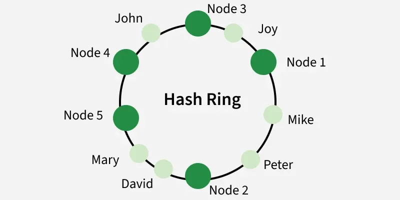
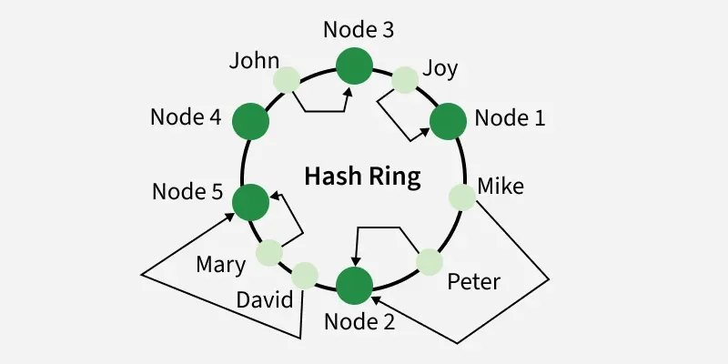

# Consistent Hashing (Revision Notes)

## Definition

Consistent hashing is a technique used in distributed systems and load balancing to distribute data or requests across multiple servers efficiently. It reduces the amount of re-mapping (rehashing) needed when servers are added or removed, improving scalability and stability.

---



---

## How Requests Are Assigned to Servers

In consistent hashing, both servers and requests are placed on a virtual ring using a hash function. For any incoming request, the system moves clockwise on the ring and assigns the request to the first server it encounters. This ensures a balanced and predictable distribution of requests.

Example: Imagine a hash ring with three servers placed at different positions: Node 1, Node 2, and Node 5. If a request is hashed to a position between Node 1 and Node 2, it will be handled by Node 2 (the next server in the clockwise direction). If Node 2 goes down, the same request will now be handled by Node 5, minimizing redistribution of other requests.



---

## The Problem with Traditional Hashing

In traditional hashing, a request is assigned to a server using:

```
server = hash(key) % N
```

Where `N` is the number of servers.

**The Problem:** When a server is added or removed, `N` changes — and almost every key gets remapped to a different server. This causes:

- Cache misses across the entire system
- Thundering herd on remaining servers
- Data loss in distributed caches

**Example:** With 3 servers, `hash(key) = 10` → Server `10 % 3 = 1`. Add a 4th server → `10 % 4 = 2`. The key now maps to a completely different server.

Consistent hashing solves this by ensuring only a small fraction of keys are remapped when the server count changes.

---

## How Consistent Hashing Solves the Problem

Instead of using `hash(key) % N`, consistent hashing places both servers and keys on a fixed virtual ring (e.g., range `0` to `2^32 - 1`).

- The ring does **not** depend on `N` — its size never changes.
- A key is always assigned to the **first server clockwise** from its position on the ring.
- When `N` changes, the ring positions of all other servers stay the same.

**Example:** Ring has Node1 at position 10, Node3 at position 50, Node5 at position 80.

```text
Key hashes to position 30 → assigned to Node3 (next clockwise)
Key hashes to position 60 → assigned to Node5 (next clockwise)
Key hashes to position 90 → wraps around → assigned to Node1
```

Now add Node2 at position 40:

```text
Key at position 30 → still assigned to Node3 ✓ (unaffected)
Key at position 60 → still assigned to Node5 ✓ (unaffected)
Only keys between position 10 and 40 now go to Node2 instead of Node3.
```

**Result:** Only `1/N` of keys are remapped on average — compared to nearly all keys with traditional hashing.

---

## Adding / Removing a Server

### Adding a Server

When a new server is added to the ring, it is placed at a hashed position. Only the keys between the new server and its predecessor (counter-clockwise neighbor) need to be remapped to the new server. All other keys are unaffected.

```text
Before: ... → Node1 → Node3 → Node5 → ...
Add Node2 between Node1 and Node3:
After:  ... → Node1 → Node2 → Node3 → Node5 → ...
Only keys that were going to Node3 (but fall between Node1 and Node2) move to Node2.
```

### Removing a Server

When a server goes down, its keys are reassigned to the next server clockwise on the ring. Again, only that server's keys are affected — nothing else changes.

**Key insight:** Only `K/N` keys are remapped on average (where K = total keys, N = number of servers), compared to nearly all keys in traditional hashing.

---

## Virtual Nodes (vnodes)

**Problem with basic consistent hashing:** With few servers, nodes are placed unevenly on the ring, causing some servers to handle far more load than others (hotspots).

**Solution:** Each physical server is mapped to multiple points on the ring (virtual nodes). The positions are spread using different hash seeds (e.g., `hash("Node1#1")`, `hash("Node1#2")`, etc.).

```text
Physical: Node1, Node2, Node3
Virtual:
  Node1 → positions 5, 42, 87
  Node2 → positions 18, 60, 95
  Node3 → positions 30, 71, 110
```

**Benefits of vnodes:**

- More uniform load distribution
- When a node fails, its load is spread across many nodes (not just one successor)
- New nodes can gradually take load from all existing nodes

**Used by:** Cassandra (by default, 256 vnodes per server)

---

## Advantages

- **Minimal reshuffling** — only `K/N` keys remapped on add/remove
- **Horizontal scalability** — easy to scale out without full redistribution
- **Fault tolerant** — node failure only affects that node's key range
- **No central coordinator** — purely decentralized assignment

---

## Disadvantages / Limitations

- **Hotspots** (without vnodes) — uneven ring placement causes load imbalance
- **More complex** to implement than simple modulo hashing
- **Cascading overload** — if a node fails and its successor is already near capacity, it absorbs all the extra load
- **Replication complexity** — maintaining replicas across the ring adds coordination overhead

---

## Real-world Use Cases

| System                        | How it uses Consistent Hashing                               |
| ----------------------------- | ------------------------------------------------------------ |
| **Apache Cassandra**          | Partitions data across nodes; uses vnodes (default 256/node) |
| **Amazon DynamoDB**           | Distributes keys across storage nodes                        |
| **Memcached / Redis Cluster** | Shards cache keys across cache servers                       |
| **Akamai CDN**                | Routes requests to the nearest edge server                   |
| **Discord**                   | Distributes voice/chat load across servers                   |

---

## Summary

|                         | Traditional Hashing | Consistent Hashing    |
| ----------------------- | ------------------- | --------------------- |
| Keys remapped on change | ~All (`K`)          | Minimal (`K/N`)       |
| Handles node add/remove | Poorly              | Gracefully            |
| Load balance            | Even (if uniform)   | Uneven without vnodes |
| Complexity              | Simple              | Moderate              |
