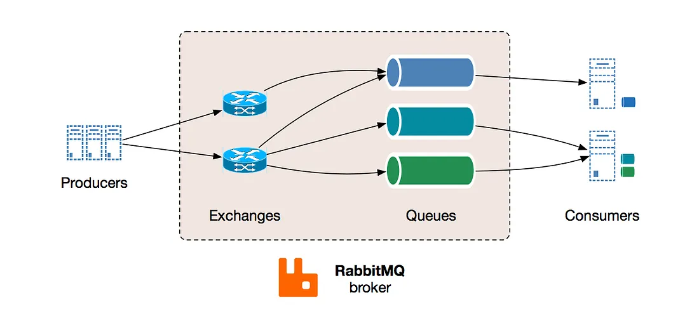

# Message Queues (Revision Notes)

## Definition

Message queuing makes it possible for applications to communicate **asynchronously** by sending messages to each other via a queue. A message queue provides temporary storage between the sender and the receiver so that the sender can keep operating without interruption when the destination program is busy or not connected.

> Asynchronous processing allows a task to call a service, and move on to the next task while the service processes the request at its own pace.

---

## Core Concepts

- A **queue** is a line of things waiting to be handled — in sequential order starting from the beginning of the line.
- A **message** is the data transported between the sender and the receiver — essentially a byte array with some headers on top. An example of a message could be an event.
- **Producer** — client application that creates messages and delivers them to the queue.
- **Consumer** — application that connects to the queue and gets messages to be processed.
- Messages placed on the queue are stored until the consumer retrieves them.
- The queue provides **protection from service outages and failures**.

```text
Producer → [ Queue ] → Consumer
```

**Examples:** Kafka, Amazon SQS, RabbitMQ, Heron, real-time streaming

---

## UI Design When MQ Is Involved

When MQ is used, work is divided between offline work (consumer) and in-line work (web app). Two common patterns:

### Pattern 1 — Inform & Poll

- Perform almost no work in the consumer (merely schedule a task).
- Inform the user that the task will happen offline.
- Use a **polling mechanism** to update the UI once the task is complete.

**Example:** Provisioning a new VM — user is told "your VM is being created" and the UI polls for status.

### Pattern 2 — Appear Complete, Finish Later

- Perform enough in-line work to make it appear to the user that the task has completed.
- Tie up hanging ends asynchronously afterward.

**Example:** Posting on Twitter/Facebook — your tweet appears immediately in your timeline, but updating all your followers' timelines happens out of band.

---

## Role of MQ in Microservice Architecture

- In a microservice architecture, different functionalities are divided across different services.
- Services have **cross-dependencies** — no single service can work without help from other services.
- Without MQ, services block waiting for responses from each other.
- Message queuing allows services to **push messages asynchronously** and ensure delivery to the correct destination without blocking.
- A **message broker** acts as the middleman (like a mailman) — takes a message from the sender and delivers it to the correct destination.

```text
Service A → [Message Broker] → Service B
                              → Service C
```

---

## Message Broker — RabbitMQ

RabbitMQ is one of the most widely used message brokers.



### Components

| Component    | Role                                           |
| ------------ | ---------------------------------------------- |
| **Producer** | Creates and sends a message                    |
| **Exchange** | Receives the message and routes it to queues   |
| **Queue**    | Stores messages until consumed                 |
| **Consumer** | Receives and processes messages from the queue |

### How It Works

1. Producer creates a message and sends it to an **Exchange**
2. Exchange receives the message and **routes it to queues** subscribed to it
3. Consumer receives messages from the queues it is subscribed to

> Messages are filtered and routed depending on the **type of exchange**.

---

## Apache Kafka

Kafka is a distributed event streaming platform used for high-throughput, fault-tolerant message queuing.

### Key Differences vs RabbitMQ

|                   | RabbitMQ                  | Kafka                            |
| ----------------- | ------------------------- | -------------------------------- |
| Model             | Message broker (push)     | Event log (pull)                 |
| Message retention | Deleted after consumption | Retained for a configurable time |
| Use case          | Task queues, routing      | Event streaming, log aggregation |
| Throughput        | Moderate                  | Very high                        |
| Ordering          | Per-queue                 | Per-partition                    |

**Use RabbitMQ when:** you need flexible routing, task queues, or per-message acknowledgment.

**Use Kafka when:** you need high throughput, event replay, or real-time data pipelines.

---

## Advantages of Message Queues

- **Decoupling** — sender and receiver don't need to interact at the same time
- **Asynchronous processing** — sender is not blocked waiting for a response
- **Fault tolerance** — messages are stored until the consumer is ready
- **Load leveling** — smooths out traffic spikes; consumers process at their own pace
- **Scalability** — add more consumers to process faster

---

## Common Interview Questions

- What is a message queue and why is it used?
- Difference between synchronous and asynchronous communication?
- What is a message broker?
- RabbitMQ vs Kafka — when to use which?
- How does MQ help in microservice architecture?
- What happens if a consumer goes down?

---

## One-Line Revision

- **Message Queue:** Temporary storage between sender and receiver for async communication.
- **Producer:** Creates messages.
- **Consumer:** Processes messages.
- **Exchange (RabbitMQ):** Routes messages to correct queues.
- **Kafka:** High-throughput event streaming with message retention.
- **RabbitMQ:** Flexible routing, task queues, push-based.
- **Decoupling:** Services don't need to be online at the same time.
- **Load Leveling:** Queue absorbs traffic spikes so consumers aren't overwhelmed.
