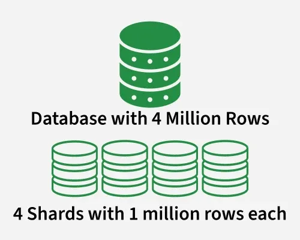
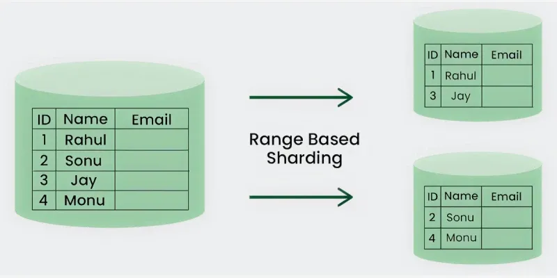
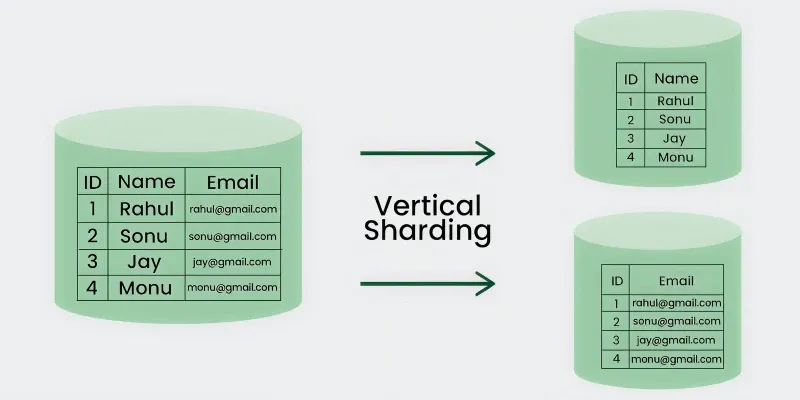
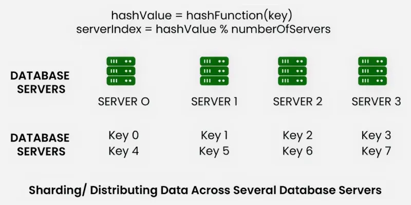

# Database Partitioning & Sharding (Revision Notes)

**Why**: single node has limits (storage, CPU, throughput). Split data across nodes to scale horizontally.

## Definition

**Data partitioning** is a technique to break a big database into smaller parts so that each partition can be managed and accessed separately, improving manageability, performance, availability, and load balancing.

**Sharding** is a specific type of horizontal partitioning where data is split across multiple database servers (shards), each shard holding a subset of the data.




---

## 1. Partitioning Methods

### 1.1 Horizontal Partitioning — Sharding

Split rows across different tables/servers. The structure (columns) of each table stays the same.

```text
Original Table: Users (1M rows)
  → Shard 1: Users with ID 1–333k
  → Shard 2: Users with ID 334k–666k
  → Shard 3: Users with ID 667k–1M
```



- **Pro:** Scales out read/write load across servers.
- **Con:** If the range key isn't chosen carefully, partitioning leads to **unbalanced servers** (hot shards).

---

### 1.2 Vertical Partitioning

Split columns across different tables/servers. The structure of the table changes.

```text
Original Table: Users (id, name, email, profile_picture, bio)
  → SQL DB Shard:  Users (id, name, email)          ← string data, expensive storage
  → Blob Storage:  Users (id, profile_picture, bio)  ← binary/large data, cheap storage
```



- **Pro:** Straightforward to implement. Low impact on the application.
- **Con:** As the application grows, a database may need further partitioning.
- **Best for:** When queries don't need all columns — split expensive vs. cheap-to-store data.

---

### 1.3 Directory-Based Partitioning

A **lookup service** (directory) sits in front of the database and knows the current partitioning scheme.

```text
Client → [Directory / Lookup Service] → Correct Shard
```


- Abstracts the partitioning logic away from application code.
- Allows adding new DB servers or changing the partitioning scheme **without impacting the application**.
- **Con:** The lookup service can become a **single point of failure**.

---

## 2. Partitioning Criteria

### 2.1 Range Partitioning

Rows are assigned to partitions based on a column value falling within a given range.

```sql
PARTITION BY RANGE (store_id) (
  PARTITION p0 VALUES LESS THAN (6),
  PARTITION p1 VALUES LESS THAN (11),
  PARTITION p2 VALUES LESS THAN (16),
  PARTITION p3 VALUES LESS THAN (21)
);
```

---

### 2.2 Hash-Based Partitioning

Apply a hash function to a key attribute to determine the partition number.



```sql
PARTITION BY HASH( YEAR(hired) )
PARTITIONS 4;
```

- **Problem:** Adding new servers requires changing the hash function → redistribution of data → downtime.
- **Workaround:** Use [Consistent Hashing](./06-consistent-hashing.md) to minimize redistribution.

---

### 2.3 List Partitioning

Each partition is assigned a discrete list of values (not a range).

```sql
PARTITION BY LIST(store_id) (
  PARTITION pNorth   VALUES IN (3,5,6,9,17),
  PARTITION pEast    VALUES IN (1,2,10,11,19,20),
  PARTITION pWest    VALUES IN (4,12,13,14,18),
  PARTITION pCentral VALUES IN (7,8,15,16)
);
```

---

### 2.4 Round-Robin Partitioning

With `n` partitions, the `i`th tuple is assigned to partition `i % n`. Ensures uniform distribution.

```text
Row 0 → Partition 0
Row 1 → Partition 1
Row 2 → Partition 2
Row 3 → Partition 0  ← wraps around
```

---

### 2.5 Composite Partitioning

Combine any of the above schemes.

- **Consistent Hashing** is a composite of hash + list partitioning.
- `Key → reduced key space via hash → list → partition`

---

## 3. Common Problems of Sharding

> Most problems arise because operations across multiple tables or rows no longer run on the same server.

### 3.1 Joins and Denormalization

- Cross-shard joins are **not performance-efficient** — data must be compiled from multiple servers.
- **Workaround:** Denormalize the database so queries can be performed from a single table.
- **Downside of workaround:** Can lead to **data inconsistency**.

---

### 3.2 Referential Integrity

- Difficult to enforce data integrity constraints (e.g., foreign keys) across shards.
- **Workarounds:**
  1. Enforce referential integrity in **application code**.
  2. Run periodic **SQL jobs** to clean up dangling references.

---

### 3.3 Rebalancing

Rebalancing becomes necessary when:

1. Data distribution is not uniform.
2. Too much load on one shard (hot shard).

- Creating more shards or rebalancing existing ones **changes the partitioning scheme** and requires data movement.
- **Workaround:** Directory-based partitioning makes rebalancing easier without impacting the app.

---

## Summary

| Method                | Splits By    | Best For                            |
| --------------------- | ------------ | ----------------------------------- |
| Horizontal (Sharding) | Rows         | Scale-out read/write across servers |
| Vertical              | Columns      | Separating hot vs. cold data        |
| Directory-Based       | Lookup table | Flexible, dynamic routing           |

| Criteria    | Key Idea                             |
| ----------- | ------------------------------------ |
| Range       | Column value falls in a range        |
| Hash        | Hash function determines partition   |
| List        | Discrete set of values per partition |
| Round-Robin | Uniform distribution via `i % n`     |
| Composite   | Combine multiple schemes             |

---

## Common Interview Questions

- What is the difference between sharding and partitioning?
- Horizontal vs vertical partitioning?
- What is directory-based partitioning?
- What are the common problems with sharding?
- How does consistent hashing help with hash-based partitioning?
- What is a hot shard and how do you fix it?

---

## One-Line Revision

- **Sharding:** Split rows across multiple servers.
- **Vertical Partitioning:** Split columns across servers/storage types.
- **Directory-Based:** Lookup service routes queries to the right shard.
- **Range:** Partition by value range.
- **Hash:** Partition by hash of a key.
- **Consistent Hashing:** Solves redistribution problem in hash partitioning.
- **Hot Shard:** One shard gets disproportionate load — fix by rebalancing or better key choice.
- **Denormalization:** Workaround for cross-shard joins — trades consistency for performance.
