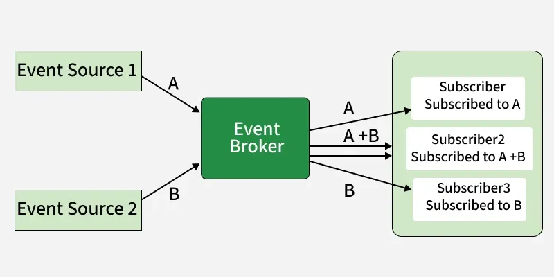

# Event-Driven Architecture (EDA)

## What is EDA?

A software design approach where system components communicate by **producing and responding to events** (user actions, state changes, etc.). Components are **loosely coupled** — they operate independently and react to events in real time.

- Components work independently without tight links
- When an event occurs, relevant components respond accordingly

> **Example (E-commerce):** When a customer places an order, an `OrderPlaced` event is generated. Payment processing, inventory management, and email notifications all independently react to this event — none of them polls the order system.



**Diagram walkthrough:**

- Event Source 1 and Event Source 2 publish events (A and B) to a central **Event Broker**
- The Event Broker receives, filters, and routes events based on subscriptions
- Subscribers get only the events they subscribed to (A, B, or A+B)

---

## Events in EDA

An **event** is a record of something that happened — a meaningful occurrence or state change.

| Property           | Description                                                  |
| ------------------ | ------------------------------------------------------------ |
| **Triggering**     | Caused by user actions, data changes, or system state        |
| **Asynchronicity** | Components work independently and in parallel                |
| **Pub-Sub model**  | Producers publish; interested parties subscribe              |
| **Event Types**    | Grouped by purpose: `UserLoggedIn`, `OrderPlaced`            |
| **Payload**        | Extra context data (e.g., `PaymentReceived` includes amount) |
| **Immutability**   | Events are immutable once created                            |
| **Event Handling** | Each component has specific handlers defining its response   |

---

## Core Components

### 1. Event Source

Any component that generates events when a significant action or state change occurs.

- Can be UIs, sensors, databases, or external systems
- The **starting point** of the event flow

### 2. Event

The core unit of communication — represents what happened and carries relevant data.

- Immutable once created
- Contains a payload describing the change

### 3. Event Broker / Event Bus

The central hub for managing event communication.

- Receives events from publishers
- Filters and routes events to appropriate subscribers
- Examples: **Apache Kafka**, **RabbitMQ**, **AWS SNS/SQS**

### 4. Publisher

Responsible for emitting events to the event bus.

- Converts system actions/changes into events
- Sends events **asynchronously**
- Does **not** need to know who consumes the events

### 5. Subscriber

Registers interest in specific types of events.

- Listens for relevant events on the event bus
- Reacts dynamically when events occur

```
Event Source --> [Event] --> Event Broker --> Subscriber A
                                        --> Subscriber B
                                        --> Subscriber C
```

---

## Supporting Patterns

| Pattern           | Role                                                                     |
| ----------------- | ------------------------------------------------------------------------ |
| **Event Handler** | Contains logic for processing received events; implements business rules |
| **Dispatcher**    | Routes events to the correct handlers; manages processing flow           |
| **Listener**      | Actively monitors the event bus; triggers processing on matching events  |

---

## Why EDA Matters (Importance)

| Property                         | Benefit                                                           |
| -------------------------------- | ----------------------------------------------------------------- |
| **Flexibility & Responsiveness** | System adapts dynamically to new information; stays agile         |
| **Scalability**                  | Components can be added/removed without affecting the rest        |
| **Real-time Processing**         | Events handled as they happen; ideal for time-sensitive tasks     |
| **Decentralized Communication**  | No point-to-point links; reduces coupling, simplifies maintenance |

---

## Real-World Applications

| Domain                 | Use Case                                                               |
| ---------------------- | ---------------------------------------------------------------------- |
| **Financial Services** | Real-time transaction processing, fraud detection, market data updates |
| **E-commerce**         | Order processing, inventory updates, payment workflows                 |
| **Telecommunications** | Network monitoring, call processing, dynamic load handling             |
| **Online Gaming**      | Real-time player interactions, game state updates, multiplayer sync    |
| **Real-Time Apps**     | Any system needing instant response to user actions or data changes    |

---

## Challenges

| Challenge                     | Detail                                                                           |
| ----------------------------- | -------------------------------------------------------------------------------- |
| **Increased Complexity**      | More events + components = harder to manage event flow and coordination          |
| **Event Order & Consistency** | Out-of-order events and grouped actions (transactions) require extra effort      |
| **Debugging & Tracing**       | Distributed + async = harder to track bugs than in traditional systems           |
| **Event Latency**             | Individual event processing can introduce delay; problematic for real-time needs |

---

## EDA vs. Request-Driven Architecture

|                   | Event-Driven                          | Request-Driven                   |
| ----------------- | ------------------------------------- | -------------------------------- |
| **Communication** | Async via events                      | Sync via direct API calls        |
| **Coupling**      | Loose (producer unaware of consumers) | Tight (caller knows callee)      |
| **Scalability**   | Easier (add subscribers freely)       | Harder (caller must handle load) |
| **Debugging**     | More complex                          | Simpler (linear call stack)      |
| **Latency**       | Variable (async)                      | Predictable (sync)               |

---

## Key Takeaway

EDA decouples system components by having them communicate through events rather than direct calls. This enables scalability, real-time responsiveness, and flexibility — at the cost of increased complexity, harder debugging, and potential event ordering issues.
